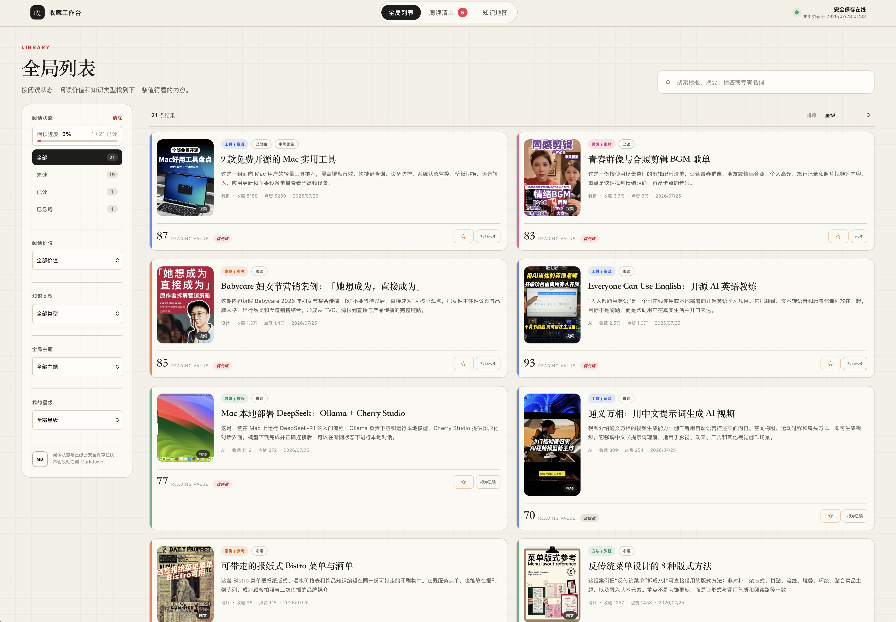
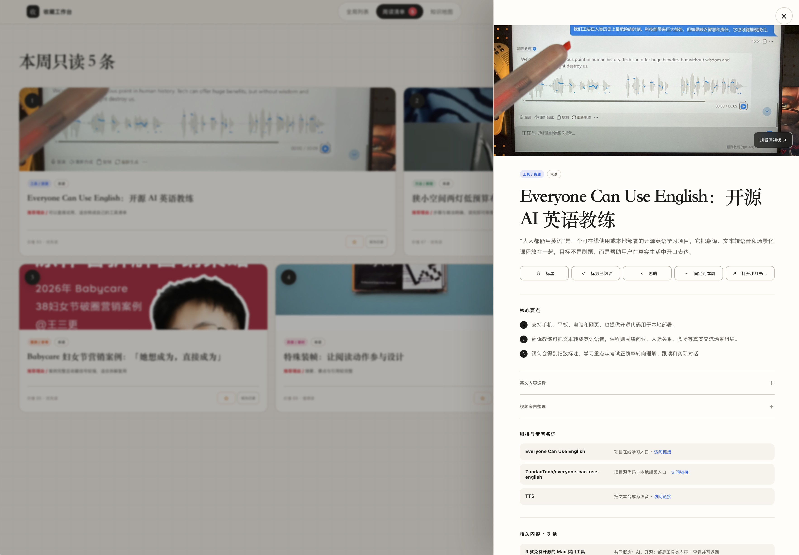
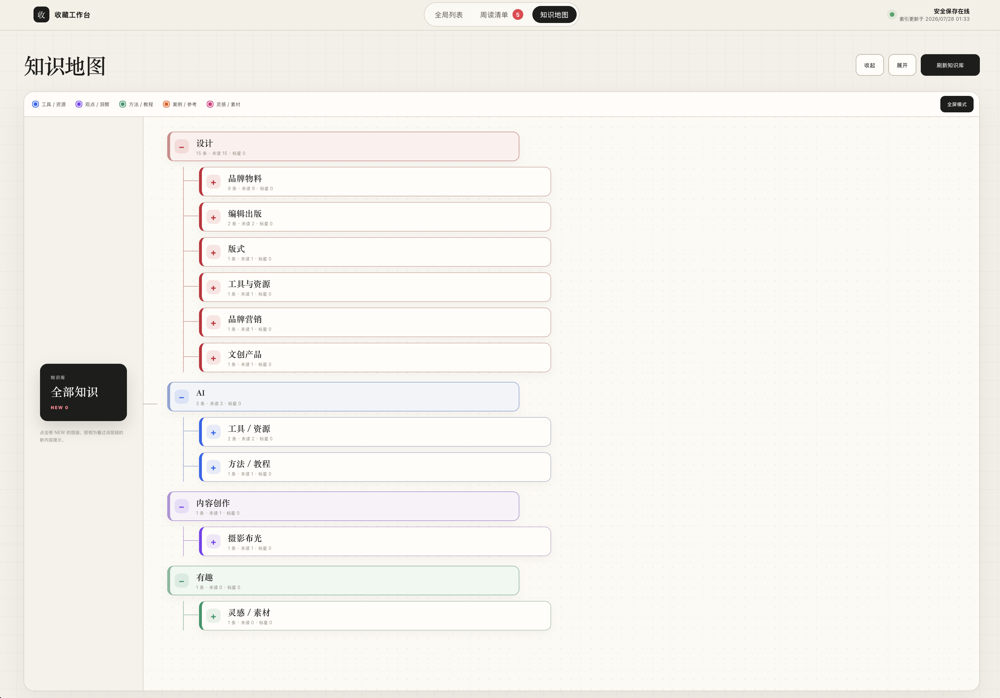
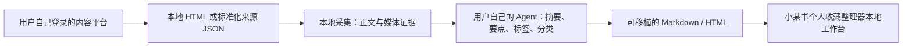
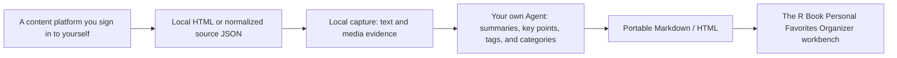

# 小某书个人收藏整理器 / The R Book Personal Favorites Organizer

一个本地优先、由个人 Agent 协助，把“以后再看”变成真正可阅读、可整理内容的个人阅读整理器。

A local-first, Agent-assisted personal reading organizer that turns “read later” into material you can actually read and understand.

[中文](#中文) · [English](#english)

> [!IMPORTANT]
> 小某书个人收藏整理器的首个公开版本只包含可复用的源码、示例配置和合成测试数据。你的账号登录态、收藏、图片、视频、浏览记录、真实配置及现有私人站点都只保留在本机，不应上传到 GitHub。

> [!IMPORTANT]
> The first public release of The R Book Personal Favorites Organizer contains reusable source code, example configuration, and synthetic test data only. Account sessions, saved content, media, reading history, real configuration, and the existing private site stay local and must not be uploaded to GitHub.

## 界面预览 / Interface Preview

<p align="center">
  <a href="docs/images/library-overview.png">
    
  </a>
</p>
<p align="center"><sub>全局列表：集中浏览、筛选和管理个人收藏 / Library overview for browsing, filtering, and managing personal favorites</sub></p>

<table>
  <tr>
    <td width="50%" align="center">
      <a href="docs/images/weekly-reading.png">
        
      </a>
    </td>
    <td width="50%" align="center">
      <a href="docs/images/knowledge-map.png">
        
      </a>
    </td>
  </tr>
  <tr>
    <td align="center"><sub>周阅读与内容详情 / Weekly reading and item detail</sub></td>
    <td align="center"><sub>知识地图 / Knowledge map</sub></td>
  </tr>
</table>

---

<a id="中文"></a>

## 中文

### 前言：这不是一个宏大的产品

这个工具没有什么稀奇的，也没有试图解决一个宏大的核心问题。它只是从一个很具体的个人需求和一套真实的使用习惯里长出来的。

它不代表我的开发能力有多强，也不代表我的产品能力有多成熟。它更像是我在 AI 时代的一种工作态度：现在，一个产品可以只从一个很小的念头开始。发现问题，与 AI 对话，把想法做出来，再在真实使用中继续修正——这就是我对 AI Coding / Chat Coding 的理解，也是小某书个人收藏整理器存在的意义。

我只是想把自己收藏却来不及阅读的内容真正整理出来，于是用这种方式把它实现了。

### 小某书个人收藏整理器是什么

小某书个人收藏整理器是一个以 Node.js 和本地 HTML 工作台为基础的个人内容处理流程：



`小某书个人收藏整理器 / The R Book Personal Favorites Organizer` 是这个项目的完整名称，数据约定则尽量保持通用。当前首个来源适配器仍然面向小红书个人收藏；未来可以继续增加其他内容来源，而不改变 Markdown 与 Agent 提炼流程。

当前版本可以：

- 从浏览器保存的收藏页 HTML 或标准化来源 JSON 中识别内容；
- 按内容 ID 去重，同时保留同一内容所属的多个收藏来源；
- 本地保存正文、原图和可用的视频素材；
- 在 macOS 上选择性使用 Apple Vision 做图片与视频画面 OCR；
- 选择性使用 `ffmpeg` 与 `whisper-cli` 提取视频旁白；
- 把本地证据整理成结构化 JSON，交给用户自己的 Agent 提炼；
- 生成可长期保存、搜索和迁移的 Markdown 与派生 HTML；
- 提供本地列表、周读清单、阅读状态与知识地图；
- 生成采集进度、失败记录和内容质量报告。

### 它不是什么

- 它不是任何内容平台的官方客户端、官方 API 或云端爬虫服务；
- 它不会替你注册、托管或共享账号；
- 它不包含通用 AI 模型，也不赠送 Agent、模型额度或第三方账号；
- 它不承诺绕过登录、验证码、反自动化机制或平台限制；
- 它不授予你转载或公开发布创作者内容的权利；
- 它目前仍是实验性工具，不是下载后即可一键运行的成熟产品。

### 设计原则

1. **本地优先**：登录态、原始内容、媒体和处理结果默认留在用户自己的设备上。
2. **Agent 可替换**：项目只定义输入与输出，不绑定某一家模型或 Agent。
3. **Markdown 优先**：即使不再使用工作台，内容仍然可读、可搜索、可迁移。
4. **人工确认**：Agent 结果先进入 `preview`，由用户检查后再标记为 `ready`。
5. **来源可扩展**：来源平台的解析逻辑与后续阅读整理流程尽量分离。
6. **公开源码与私人数据分离**：GitHub 只保存工具本身，不保存个人收藏。

### 技术架构

| 层 | 职责 | 主要位置 |
| --- | --- | --- |
| 来源与采集 | 解析 HTML 或来源 JSON，获取正文与媒体 | `src/inventory.mjs`, `src/source-snapshot.mjs`, `src/collect.mjs`, `src/xhs-state.mjs`, `src/media.mjs` |
| Agent 提炼 | 导出证据 JSON，校验并接收结构化结果 | `scripts/build-enrichment-input.mjs`, `src/enrich.mjs` |
| 内容渲染 | 生成 Markdown 与派生 HTML | `src/render.mjs` |
| 本地工作台 | 列表、筛选、周读、状态与知识地图 | `workbench/`, `src/workbench-data.mjs`, `scripts/serve-workbench.mjs` |
| 本地报告 | 采集进度、失败记录与质量缺口 | `scripts/build-import-report.mjs`, `scripts/validate-content.mjs` |

### 你需要准备什么

#### 必需

- Node.js 22 或更高版本；
- 你自己的内容平台账号，以及由你本人完成登录的本地浏览器会话；
- 一个能够读取本地文件并输出合法 JSON 的个人 Agent；
- 对本机终端和项目目录的访问权限。

Agent 可以是你已经在使用的编程 Agent，也可以是其他支持本地文件、浏览器和结构化输出的工具。仓库不内置 Agent，也不要求固定品牌。

便利性本身也是一种真实需求。如果腾讯 WorkBuddy 这类更贴近日常使用的 Agent 能降低上手门槛、让资料管理更顺手，也可以考虑让它遵循同一套输入与输出约定。

#### 按需选装

- **图片 OCR**：macOS、`swiftc` 与 Apple Vision；
- **视频抽帧和音频提取**：`ffmpeg`；
- **视频转写**：`whisper-cli` 与本地 Whisper 模型；
- **浏览器协助**：一个能够操作已登录浏览器页面的 Agent。

建议先关闭 OCR 和视频转写，用一条内容验证完整流程，再逐项开启可选能力。

### 快速开始

克隆仓库后，先创建只供本机使用的配置：

```bash
cp config.example.json config.json
cp workbench.config.example.json workbench.config.json
```

`config.json` 用于来源和媒体处理选项：

```json
{
  "board": {
    "id": "replace-with-your-source-id",
    "name": "My Favorites",
    "url": "https://www.xiaohongshu.com/"
  },
  "schedule": {
    "mode": "manual",
    "timezone": "Asia/Shanghai"
  },
  "processing": {
    "saveOriginalImages": true,
    "keepRawVideo": false,
    "transcribeVideo": false,
    "ocrImages": false,
    "ocrVideoFrames": false,
    "videoFrameIntervalSeconds": 3,
    "maxVideoFrames": 12,
    "whisperModel": "/absolute/path/to/whisper-model.bin"
  }
}
```

`config.json` 与 `workbench.config.json` 已由 `.gitignore` 排除。不要把真实账号信息、临时访问参数或本机路径写入示例配置。

先运行公开测试与发布边界检查：

```bash
npm test
npm run check:release
```

### 连接你自己的账号

当前版本没有官方 OAuth，也不会直接接管账号。推荐的方式是“用户本地登录 + 页面快照交接”：

1. 你在自己的常用浏览器中手动登录；
2. 二维码、验证码和二次验证由你本人完成；
3. 打开目标收藏列表，逐步滚动并等待需要整理的内容加载完成；
4. 让具备浏览器能力的 Agent 只提取已加载页面中的最小字段；
5. 把结果写入被忽略的本地目录，例如 `work/imports/favorites.json`；
6. 小某书个人收藏整理器读取快照，不读取或保存账号密码。

推荐的来源 JSON 格式：

```json
{
  "version": 1,
  "capturedAt": "2026-07-28T00:00:00.000Z",
  "source": {
    "id": "my-favorites",
    "name": "全部收藏",
    "kind": "favorite",
    "url": "https://www.xiaohongshu.com/"
  },
  "items": [
    {
      "noteId": "NOTE_ID",
      "displayTitle": "页面中显示的标题",
      "type": "normal",
      "author": "作者",
      "xsecToken": "TEMPORARY_ACCESS_TOKEN"
    }
  ]
}
```

`source.id` 应在增量运行中保持稳定。`xsecToken` 是临时访问参数，也应视为私有数据：只能留在被忽略的本地目录，不能提交到 GitHub、Issue 或公开日志。

以保守的小批次开始采集：

```bash
npm run collect -- \
  --source-json work/imports/favorites.json \
  --max-new 20 \
  --delay-ms 30000
```

如果只能获得包含完整页面状态的 HTML，也可以先用一条内容验证：

```bash
npm run collect -- \
  --board-html work/imports/board.html \
  --limit 1
```

截图本身不包含采集器需要的结构化状态。页面结构变化也可能使解析失效。请保持低频、小批量运行，遵守平台规则，只处理你有权访问和保存的内容。

可给浏览器 Agent 使用下面的约束：

```text
只整理我已经登录并打开的页面中当前已加载的收藏条目。
不要询问、读取或输出账号密码，不要导出 Cookie。
按 README 的来源 JSON 结构提取最小必要字段，按 noteId 去重，
并只写入 work/imports/favorites.json。
不要上传文件，不要修改 archive、data 或 config。
```

### 配置你自己的 Agent

小某书个人收藏整理器不调用固定的模型 API。Agent 的任务是读取本地证据并生成结构化提炼结果。

先生成输入文件：

```bash
npm run build:enrichment-input -- \
  --output work/enrichment-input.json
```

让 Agent 读取这个文件，并把结果写成以下结构的合法 JSON：

```json
{
  "NOTE_ID": {
    "displayTitle": "清晰、可检索的人类标题",
    "contentSummary": "一句话摘要",
    "keyPoints": [
      "关键要点一",
      "关键要点二"
    ],
    "tags": [
      "最多五个标签"
    ],
    "category": "分类",
    "transcriptEdited": "可选：整理后的视频旁白",
    "sourceLanguage": "可选：en",
    "translatedText": "可选：非中文内容的中文速译",
    "references": [
      {
        "name": "引用对象名称",
        "type": "品牌、地点、产品、网站等",
        "url": "https://example.com",
        "description": "为什么值得保留"
      }
    ]
  }
}
```

推荐提示词：

```text
读取 work/enrichment-input.json，并为每个 noteId 生成结构化结果。

要求：
1. 只根据输入中的正文、OCR、旁白和来源信息总结，不要编造。
2. displayTitle 要清晰、自然、可检索，不使用 noteId。
3. contentSummary 只写一句话。
4. keyPoints 保留 2–4 条；tags 不超过 5 个。
5. 只有证据明确时才写 references；URL 必须使用 http(s)。
6. 非中文内容增加 sourceLanguage 和 translatedText。
7. 有视频旁白时可输出 transcriptEdited，但不要改变原意。
8. 只返回合法 JSON，不要加入 Markdown 代码围栏或解释。
9. 不修改 archive、data 或 config，只把结果写入
   work/enrichment-output.json。
```

Agent 的最小权限应当是：

- 读取 `work/enrichment-input.json`；
- 写入明确指定的 `work/enrichment-output.json`；
- 在需要时运行 README 中列出的本地命令；
- 如需采集，只控制已经由你登录好的浏览器标签页。

不要授予 Agent 读取密码、Cookie、API Key、系统钥匙串或无关私人目录的权限。若使用云端 Agent，只提供任务所需的最小输入，并先理解其数据处理政策。

### 审核结果与打开工作台

先把 Agent 结果作为预览应用：

```bash
node src/enrich.mjs \
  --summaries work/enrichment-output.json

npm run validate
npm run build:workbench
npm run workbench
```

默认地址：

```text
http://127.0.0.1:4317
```

确认内容无误后，可以显式标记为已审核：

```bash
node src/enrich.mjs \
  --summaries work/enrichment-output.json \
  --ready
```

`--ready` 在首个版本中只是用户确认边界，不会自动把内容写入任何外部服务。

### 线上个人知识库

如果你希望把整理结果保存到一个随时可访问的线上个人知识库，后续版本会提供可配置的知识库接入能力。

不同用户的账号、凭证、知识库结构和 Agent 环境并不相同，因此首个版本只保证本地 Markdown、派生 HTML 与本地工作台，不绑定也不提供任何特定服务的适配器。未来的接入也会保持可选、可替换，并由用户使用自己的账号和凭证。

### 本地输出

每条内容的本地主产物类似：

```text
archive/<内容池或收藏夹名称>/<内容标识>/
├── <可读标题>.md
├── <可读标题>.html
├── metadata.json
├── images/
├── video-transcript.txt
└── video-ocr.txt
```

这些文件用于个人阅读，不属于建议公开提交的源码。

### GitHub 项目结构

```text
The-R-Book-Personal-Favorites-Organizer/
├── README.md
├── LICENSE
├── SECURITY.md
├── CONTRIBUTING.md
├── package.json
├── config.example.json
├── workbench.config.example.json
├── examples/
│   ├── source-snapshot.example.json
│   └── enrichment-output.example.json
├── src/
├── scripts/
├── workbench/
│   ├── index.html
│   ├── app.js
│   └── styles.css
├── test/
│   └── fixtures/              # 仅合成数据
├── docs/
│   └── RELEASING.md
├── .github/
│   └── workflows/
│       └── test.yml
└── .gitignore
```

公开与本地边界：

| 公开提交 | 仅保留在本地 |
| --- | --- |
| `src/`, `scripts/`, `workbench/` | `archive/`, `data/`, `work/` |
| 示例配置与合成 fixture | `config.json`, `workbench.config.json` |
| README、MIT License、安全说明、CI | `reports/`, `review/`, `bin/`, `.firecrawl/` |
| Agent 输入输出示例 | 当前私人部署工作区 `site/` |

发布前运行：

```bash
npm test
npm run check:release
git status --short --ignored
git add --dry-run .
```

不要把整个工作目录直接压缩上传。应通过 Git 候选文件检查确认公开范围。

### 隐私、版权与合规

- 只处理你有权访问和保存的内容；
- 默认将归档、媒体、页面快照、阅读状态和兴趣配置留在本机；
- 不要公开发布他人的原图、视频、正文或个人信息；
- 不要尝试绕过验证码、访问控制、反自动化机制或平台限制；
- 使用低频、可恢复的小批次流程，并接受页面改版可能导致工具失效；
- 本项目与小红书、腾讯、OpenAI 或任何 Agent 提供商均无隶属或官方合作关系。

### 愿景

今天的互联网像一台永远不会停下来的内容生成机器。我们不停地浏览、点赞、收藏，收藏夹越来越大，真正读完和消化的内容却越来越少，最后留下的往往不是知识，而是焦虑。

小某书个人收藏整理器不是为了帮助我们收藏得更多。恰恰相反，它希望把无限的信息流变成一份有限、可以读完的清单：把内容带离推荐流，重新放回阅读、理解和行动之中。

如果它能帮助我们少刷一点，多读一点；少制造一点“以后再看”的负担，多留一点时间给真实生活，那就已经足够了。

### 开源协议

小某书个人收藏整理器使用 [MIT License](LICENSE)。你可以在协议允许的范围内自由使用、复制、修改、合并、发布和分发本项目。

---

<a id="english"></a>

## English

### Preface: this is not a grand product

There is nothing extraordinary about this tool, and it does not claim to solve a grand, fundamental problem. It grew out of one small personal need and a real way of working.

It is not proof of exceptional engineering or product skill. It represents an attitude toward work in the AI era: a product can begin with a very small idea. Notice a problem, talk it through with AI, make the idea real, and keep correcting it through actual use. That is how I understand AI Coding / Chat Coding, and that is why The R Book Personal Favorites Organizer exists.

I simply wanted to turn the things I had saved but never had time to read into material I could actually work through, so I built it this way.

### What The R Book Personal Favorites Organizer is

The R Book Personal Favorites Organizer is a personal content pipeline built around Node.js and a local HTML workbench:



`The R Book Personal Favorites Organizer` is the project's full English name, while its data contracts are designed to remain general. The first source adapter currently targets personal Xiaohongshu saves. Other sources can be added later without changing the Markdown or Agent-enrichment workflow.

The current version can:

- discover content from saved collection-page HTML or normalized source JSON;
- deduplicate by content ID while retaining multiple collection memberships;
- save text, original images, and available video evidence locally;
- optionally run image and video-frame OCR through Apple Vision on macOS;
- optionally extract video speech with `ffmpeg` and `whisper-cli`;
- prepare structured evidence JSON for the user's own Agent;
- produce durable, searchable Markdown and derived HTML;
- provide a local library, weekly reading list, reading state, and knowledge map;
- report capture progress, failures, and content-quality gaps.

### What it is not

- It is not an official client, API, or hosted scraping service for any platform.
- It does not register, host, or share an account for you.
- It does not bundle a universal model, Agent, usage quota, or third-party account.
- It does not promise to bypass login, CAPTCHA, anti-automation systems, or platform limits.
- It does not grant permission to republish creators' content.
- It remains an experimental tool rather than a polished one-click product.

### Design principles

1. **Local first**: login state, original content, media, and generated results stay on the user's device by default.
2. **Replaceable Agent**: the project defines input and output instead of binding to one model or Agent.
3. **Markdown first**: content remains readable, searchable, and portable without the workbench.
4. **Human review**: Agent output starts in `preview` and becomes `ready` only after user review.
5. **Extensible sources**: platform parsing is kept separate from the reading and enrichment workflow.
6. **Public code, private data**: GitHub stores the tool, never the user's personal collection.

### Architecture

| Layer | Responsibility | Main location |
| --- | --- | --- |
| Source and capture | Parse HTML or source JSON and retrieve text and media | `src/inventory.mjs`, `src/source-snapshot.mjs`, `src/collect.mjs`, `src/xhs-state.mjs`, `src/media.mjs` |
| Agent enrichment | Export evidence JSON and validate structured result JSON | `scripts/build-enrichment-input.mjs`, `src/enrich.mjs` |
| Rendering | Generate Markdown and derived HTML | `src/render.mjs` |
| Local workbench | Library, filters, weekly list, state, and knowledge map | `workbench/`, `src/workbench-data.mjs`, `scripts/serve-workbench.mjs` |
| Local reports | Capture progress, failures, and quality gaps | `scripts/build-import-report.mjs`, `scripts/validate-content.mjs` |

### Requirements

#### Required

- Node.js 22 or newer;
- your own content-platform account and a local browser session you sign in to yourself;
- your own Agent, capable of reading local files and returning valid JSON;
- terminal and project-directory access on your machine.

The Agent may be a coding Agent you already use or another tool with local-file, browser, and structured-output capabilities. The R Book Personal Favorites Organizer does not bundle an Agent or require a particular brand.

Convenience is a real requirement too. If an everyday Agent such as Tencent WorkBuddy lowers the setup barrier and makes ongoing material management easier, it can also be considered as long as it follows the same input and output contract.

#### Optional

- **Image OCR**: macOS, `swiftc`, and Apple Vision;
- **Video frame and audio extraction**: `ffmpeg`;
- **Video transcription**: `whisper-cli` and a local Whisper model;
- **Browser assistance**: an Agent that can operate a page you have already signed in to.

Start with OCR and transcription disabled. Validate one item end to end before enabling optional features.

### Quick start

After cloning the repository, create local-only configuration:

```bash
cp config.example.json config.json
cp workbench.config.example.json workbench.config.json
```

`config.json` defines the source and media-processing options:

```json
{
  "board": {
    "id": "replace-with-your-source-id",
    "name": "My Favorites",
    "url": "https://www.xiaohongshu.com/"
  },
  "schedule": {
    "mode": "manual",
    "timezone": "Asia/Shanghai"
  },
  "processing": {
    "saveOriginalImages": true,
    "keepRawVideo": false,
    "transcribeVideo": false,
    "ocrImages": false,
    "ocrVideoFrames": false,
    "videoFrameIntervalSeconds": 3,
    "maxVideoFrames": 12,
    "whisperModel": "/absolute/path/to/whisper-model.bin"
  }
}
```

Both `config.json` and `workbench.config.json` are ignored by Git. Never put real account information, temporary access parameters, or machine-specific paths into the example files.

Run the public tests and release-boundary check:

```bash
npm test
npm run check:release
```

### Connect your own account

The current release does not provide official OAuth and does not take control of an account. The recommended handoff is “local user login plus a page snapshot”:

1. Sign in manually in your usual browser.
2. Complete QR login, CAPTCHA, and two-factor verification yourself.
3. Open the target collection, scroll gradually, and wait for the desired items to load.
4. Let a browser-capable Agent extract only the minimum fields already present on the loaded page.
5. Write the result to an ignored local path such as `work/imports/favorites.json`.
6. The R Book Personal Favorites Organizer consumes the snapshot without reading or storing an account password.

Recommended source JSON:

```json
{
  "version": 1,
  "capturedAt": "2026-07-28T00:00:00.000Z",
  "source": {
    "id": "my-favorites",
    "name": "All favorites",
    "kind": "favorite",
    "url": "https://www.xiaohongshu.com/"
  },
  "items": [
    {
      "noteId": "NOTE_ID",
      "displayTitle": "Title shown on the page",
      "type": "normal",
      "author": "Author",
      "xsecToken": "TEMPORARY_ACCESS_TOKEN"
    }
  ]
}
```

Keep `source.id` stable across incremental runs. Treat `xsecToken` as private temporary access data: keep it inside ignored local directories and never commit it to GitHub or paste it into an issue or public log.

Start with a conservative batch:

```bash
npm run collect -- \
  --source-json work/imports/favorites.json \
  --max-new 20 \
  --delay-ms 30000
```

If complete HTML containing the page state is the only available input, validate one item first:

```bash
npm run collect -- \
  --board-html work/imports/board.html \
  --limit 1
```

A screenshot does not contain the structured state required by the collector. Page changes may also break the parser. Run in small, infrequent batches, follow platform rules, and process only material you are entitled to access and save.

Suggested constraints for a browser Agent:

```text
Organize only the currently loaded items on the page that I have already
signed in to and opened. Do not ask for, read, or reveal passwords, and do not
export cookies. Follow the README source JSON shape, extract only the minimum
required fields, deduplicate by noteId, and write only to
work/imports/favorites.json. Do not upload files or modify archive, data, or
config.
```

### Configure your own Agent

The R Book Personal Favorites Organizer does not call a fixed model API. The Agent reads local evidence and produces a structured enrichment result.

Build the input:

```bash
npm run build:enrichment-input -- \
  --output work/enrichment-input.json
```

Ask the Agent to write valid JSON with this shape:

```json
{
  "NOTE_ID": {
    "displayTitle": "A clear, searchable human title",
    "contentSummary": "A one-sentence summary",
    "keyPoints": [
      "Key point one",
      "Key point two"
    ],
    "tags": [
      "No more than five tags"
    ],
    "category": "Category",
    "transcriptEdited": "Optional: cleaned video transcript",
    "sourceLanguage": "Optional: en",
    "translatedText": "Optional: Chinese translation of non-Chinese content",
    "references": [
      {
        "name": "Referenced entity",
        "type": "brand, place, product, website, etc.",
        "url": "https://example.com",
        "description": "Why it is worth retaining"
      }
    ]
  }
}
```

Suggested prompt:

```text
Read work/enrichment-input.json and produce one structured result for each
noteId.

Requirements:
1. Use only the supplied text, OCR, transcript, and source metadata. Do not
   invent facts.
2. Make displayTitle clear, natural, and searchable. Do not use noteId.
3. Keep contentSummary to one sentence.
4. Return 2-4 keyPoints and no more than 5 tags.
5. Add references only when supported by evidence; URLs must use http(s).
6. Add sourceLanguage and translatedText for non-Chinese content.
7. transcriptEdited may clean a transcript without changing its meaning.
8. Return valid JSON only, with no Markdown fence or explanation.
9. Do not modify archive, data, or config. Write only to
   work/enrichment-output.json.
```

The Agent's minimum permissions should be:

- read `work/enrichment-input.json`;
- write the explicit `work/enrichment-output.json` target;
- run only the local commands listed in this README when needed;
- operate only the browser tab you have already signed in to when capture is required.

Do not grant access to passwords, cookies, API keys, system keychains, or unrelated private directories. When using a cloud Agent, provide only the minimum task input and review its data policy first.

### Review and open the workbench

Apply Agent output as a preview:

```bash
node src/enrich.mjs \
  --summaries work/enrichment-output.json

npm run validate
npm run build:workbench
npm run workbench
```

Default address:

```text
http://127.0.0.1:4317
```

After reviewing the content, mark it as approved:

```bash
node src/enrich.mjs \
  --summaries work/enrichment-output.json \
  --ready
```

In the first release, `--ready` is only a user-approval boundary. It does not write content to an external service.

### Online personal knowledge bases

If you want the organized material to live in an online personal knowledge base that is available anywhere, a later release will add configurable knowledge-base integrations.

Accounts, credentials, knowledge-base structures, and Agent environments differ from user to user. The first release therefore guarantees only local Markdown, derived HTML, and the local workbench; it does not bind to or ship an adapter for any specific service. Future integrations will remain optional, replaceable, and based on each user's own account and credentials.

### Local output

Each item produces local artifacts similar to:

```text
archive/<content-pool-or-collection-name>/<content-id>/
├── <readable-title>.md
├── <readable-title>.html
├── metadata.json
├── images/
├── video-transcript.txt
└── video-ocr.txt
```

These files are intended for personal reading and are not part of the recommended public source repository.

### GitHub repository layout

```text
The-R-Book-Personal-Favorites-Organizer/
├── README.md
├── LICENSE
├── SECURITY.md
├── CONTRIBUTING.md
├── package.json
├── config.example.json
├── workbench.config.example.json
├── examples/
│   ├── source-snapshot.example.json
│   └── enrichment-output.example.json
├── src/
├── scripts/
├── workbench/
│   ├── index.html
│   ├── app.js
│   └── styles.css
├── test/
│   └── fixtures/              # synthetic data only
├── docs/
│   └── RELEASING.md
├── .github/
│   └── workflows/
│       └── test.yml
└── .gitignore
```

Public versus local boundary:

| Commit publicly | Keep local only |
| --- | --- |
| `src/`, `scripts/`, `workbench/` | `archive/`, `data/`, `work/` |
| Example configuration and synthetic fixtures | `config.json`, `workbench.config.json` |
| README, MIT License, security guidance, and CI | `reports/`, `review/`, `bin/`, `.firecrawl/` |
| Agent input/output examples | Current private deployment workspace `site/` |

Before publishing:

```bash
npm test
npm run check:release
git status --short --ignored
git add --dry-run .
```

Do not upload a zip of the entire working directory. Review the exact Git candidate set instead.

### Privacy, copyright, and responsible use

- Process only content you are entitled to access and save.
- Keep archives, media, page snapshots, reading state, and interest profiles local by default.
- Do not publicly republish other people's images, videos, text, or personal information.
- Do not bypass CAPTCHA, access control, anti-automation systems, or platform limits.
- Use small, recoverable, infrequent batches and expect page changes to break the tool.
- This project is not affiliated with or endorsed by Xiaohongshu, Tencent, OpenAI, or any Agent provider.

### Vision

The internet has become a machine that never stops generating. We scroll, like, and save faster than we can read. Our collections grow, our understanding does not, and the gap often turns into anxiety.

The R Book Personal Favorites Organizer is not meant to help us save even more. It tries to turn an infinite feed into a finite reading list: to take content out of the recommendation loop and return it to reading, understanding, and action.

If it helps us scroll a little less, read a little more, carry less “read later” debt, and leave more attention for real life, that is enough.

### License

The R Book Personal Favorites Organizer is released under the [MIT License](LICENSE). You may use, copy, modify, merge, publish, and distribute the project under its terms.
